##############################################################################
0. Chapter Getting Ready (Important)
##############################################################################

Before starting building the projects, you need to make some preparation first, which is so crucial that you must not skip.

.. raw:: html

    <iframe style="display: block; margin: 0 auto;" height="421.875" width="750" src="https://www.youtube.com/embed/3M2AwitB1pk" frameborder="0" allowfullscreen></iframe>

.. _Programming:

Programming Software
******************************

Arduino Software (IDE) is used to write and upload the code for Arduino Board.

First, install Arduino Software (IDE): visit https://www.arduino.cc/en/software/

.. image:: ../_static/imgs/0_Ready/Preface03.png
    :align: center
    :class: image-border
    :width: 99%

Select and download corresponding installer based on your operating system. If you are a Windows user, please select the "Windows" to download and install the driver correctly.

.. image:: ../_static/imgs/0_Ready/Preface04.png
    :align: center

After the downloading completes, run the installer. For Windows users, there may pop up an installation dialog box of driver during the installation process. When it is popped up, please allow the installation.

After installation is completed, an shortcut will be generated in the desktop.

.. image:: ../_static/imgs/0_Ready/Preface05.png
    :align: center

Run it. The interface of the software is as follows:

.. image:: ../_static/imgs/0_Ready/Preface06.png
    :align: center

Programs written with Arduino IDE are called sketches. These sketches are written in a text editor and are saved with the file extension.ino. The editor has features for cutting/pasting and for searching/replacing text. The console displays text output by the Arduino IDE, including complete error messages and other information. The bottom right-hand corner of the window displays the configured board and serial port. The toolbar buttons allow you to verify and upload programs, open the serial monitor, and access the serial plotter.

.. table::
    :align: center
    :class: table-line
    :width: 80%
    
    +-------------+---------------------------------------------------------------------+
    | |Preface07| | Verify                                                              |
    |             |                                                                     |
    |             | Checks your code for errors compiling it.                           |
    +-------------+---------------------------------------------------------------------+
    | |Preface08| | Upload                                                              |
    |             |                                                                     |
    |             | Compiles your code and uploads it to the configured board.          |
    +-------------+---------------------------------------------------------------------+
    | |Preface09| | Debug                                                               |
    |             |                                                                     |
    |             | Troubleshoot code errors and monitor program running status.        |
    +-------------+---------------------------------------------------------------------+
    | |Preface10| | Serial Plotter                                                      |
    |             |                                                                     |
    |             | Real-time plotting of serial port data charts.                      |
    +-------------+---------------------------------------------------------------------+
    | |Preface11| | Serial Monitor                                                      |
    |             |                                                                     |
    |             | Used for debugging and communication between devices and computers. |
    +-------------+---------------------------------------------------------------------+

.. |Preface07| image:: ../_static/imgs/0_Ready/Preface07.png
.. |Preface08| image:: ../_static/imgs/0_Ready/Preface08.png
.. |Preface09| image:: ../_static/imgs/0_Ready/Preface09.png
.. |Preface10| image:: ../_static/imgs/0_Ready/Preface10.png
.. |Preface11| image:: ../_static/imgs/0_Ready/Preface11.png

Installation of Development Board Support Package
********************************************************

1.	Make sure your network is of good connection.

2.	Open Arduino IDE, and click File -> Preference. In new pop-up window, find "Additional Boards Manager URLs", and replace with a new line:

https://github.com/earlephilhower/arduino-pico/releases/download/global/package_rp2040_index.json

As shown below:

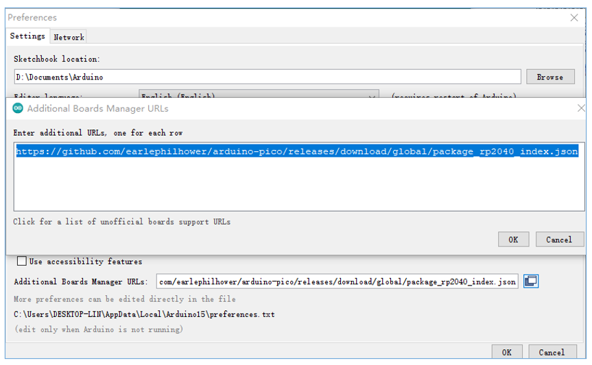

3.	Open Arduino IDE; click Boards Manager on the left.

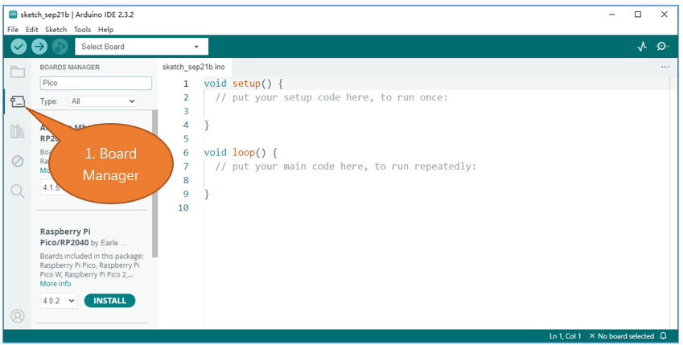

4.	Enter Pico in the searching box, and select "Raspberry Pi Pico/RP2040" and click on Install.

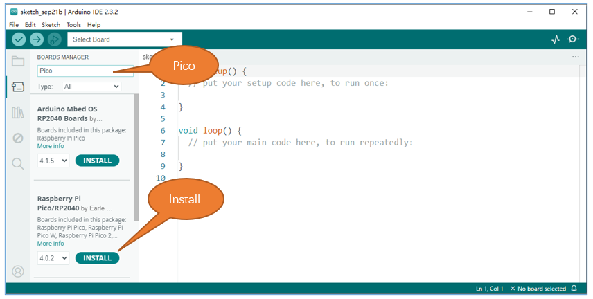

5.	Click Yes in the pop-up "dpinst-amd64.exe"installation window. (Without it, you will fail to communicate with Arduino.) Thus far, we have finished installing the development support package.

.. _Firmware:

Uploading Arduino-compatible Firmware for Pico 
*****************************************************

If your Pico is new and you want to use Arduino to learn and develop, you need to upload an Arduino-compatible Firmware for it. Please refer to the following steps to configure. 

1. Disconnect Pico from computer. Keep pressing the white button (BOOTSEL) on Pico, and connect Pico to computer before releasing the button. (Note: Be sure to keep pressing the button before powering the Pico, otherwise the firmware will not download successfully)

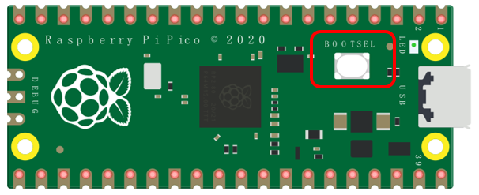

2. Open Arduino IDE. Click File -> Examples -> 01.Basics -> Blink.

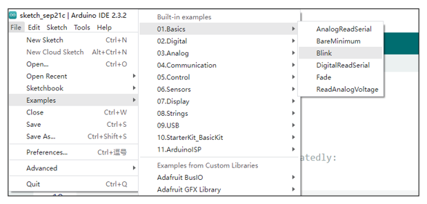

3. Click Tools -> Board -> Raspberry Pi RP2040 Boards -> Raspberry Pi Pico.

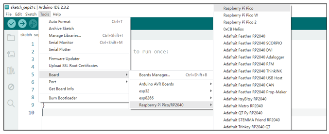

4. Click Tools -> Port -> UF2 Board.

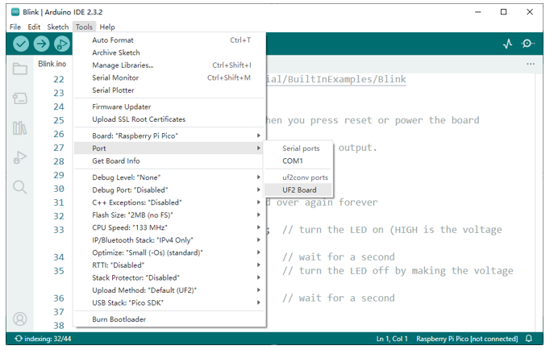

5. Upload sketch to Pico.

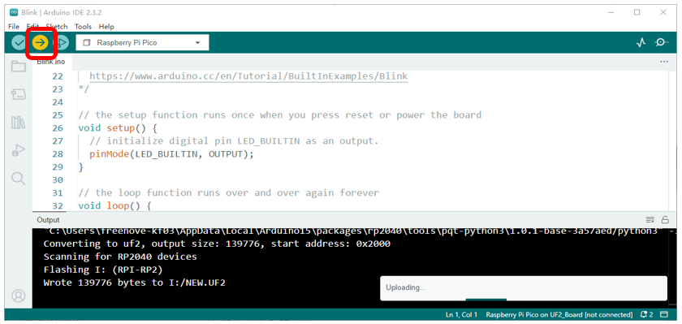

When the sketch finishes uploading, you can see the following prompt.

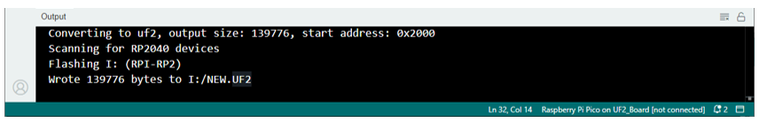

And you can see the indicator on Pico starts to flash.

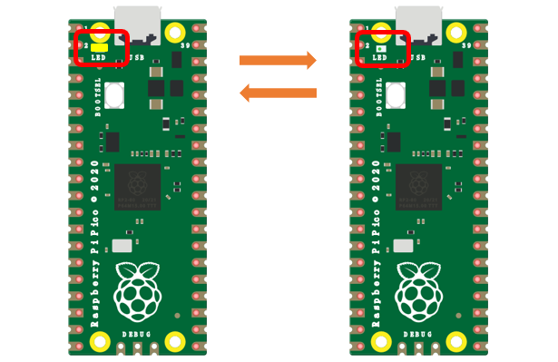

5. Click Tools -> Port -> COMx(Raspberry Pi Pico). X of COMx varies from different computers. Please select the correct one on your computer. In our case, it is COM15. 

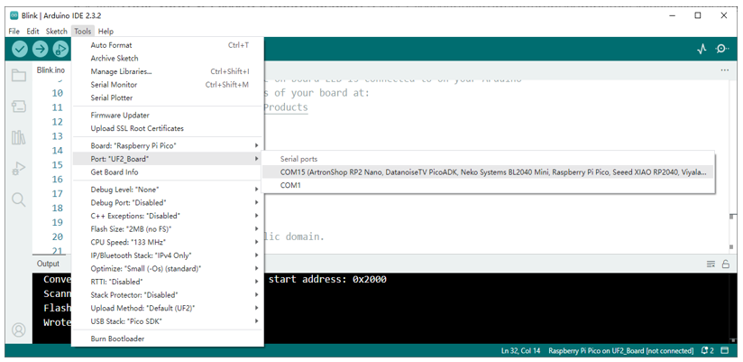

.. note::

    :red:`1. At the first time you use Arduino to upload sketch for Pico, you do not need to select port. After that, each time before uploading sketch, please check whether the port has been selected; otherwise, the downloading may fail.`
    
    :red:`2. Sometimes when using, Pico may lose firmware due to the code and fail to work. At this point, you can upload firmware for Pico as mentioned above.`

Paste the Sticker on the Breadboard
********************************************

It is not difficult to use the Pico. However, officially, the pin functions are printed on the back of the board, which makes it inconvenient to use. To help users finish each project in the tutorial faster and easier, we provide stickers of the pin functions as follows:

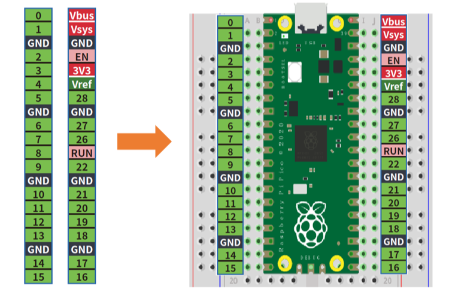

You can paste the sticker on the blank area of the breadboard as above.

To make the tutorial more intuitive, we have made some changes to the simulation diagram as below. The left one is the actual Pico and the right one is its simulation diagram. Please note that to avoid misunderstanding.

In addition, the external pin interface functions of Pico, Pico W and Pico 2 are identical.

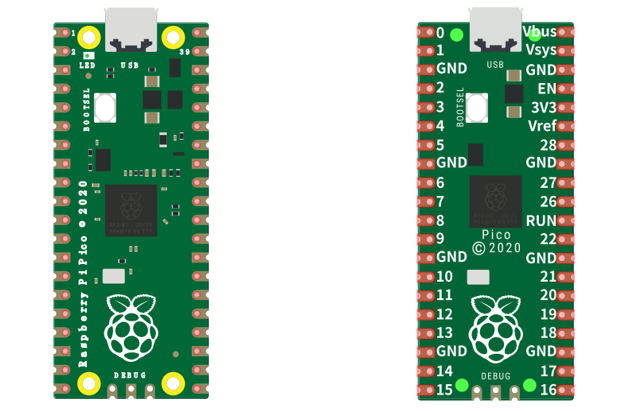